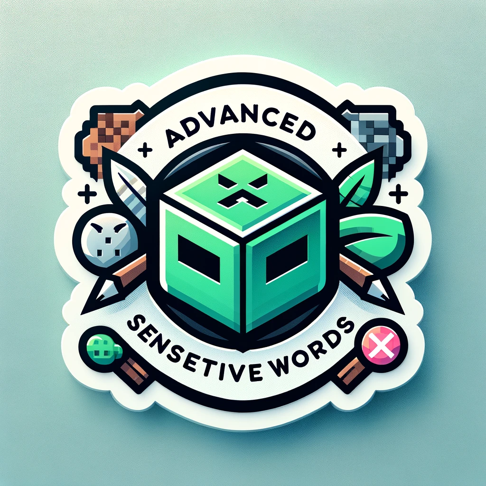

# AdvancedSensitiveWords
One-stop-shop **ultimate** anti-swear solution for your Minecraft server!

[English](https://github.com/hahawth/AdvancedSensitiveWords/blob/main/README.md)
[简体中文](https://github.com/hahawth/AdvancedSensitiveWords/blob/main/README_zh.md)
<p align="center">
  
</p>

Logo designed by GPT-4

[](https://www.codefactor.io/repository/github/hahawth/advancedsensitivewords)
[](https://www.java.com/)
[](https://github.com/hahawth/AdvancedSensitiveWords/stargazers)

[](https://github.com/HaHaWTH/AdvancedSensitiveWords/releases) [](https://github.com/HaHaWTH/AdvancedSensitiveWords/blob/master/LICENSE) 

## Features
1. Using DFA(Deterministic Finite Automata) algorithm
2. Plug-and-play
3. Huge and high-quality default dictionary (Over 60,000 words)
4. Blazing fast by using packets (32,000+ queries per second on a 2-core server)
5. 100% compatibility with chat plugins (Tested over 30+ plugins)
6. Full-customizable
7. Sign check support
8. Anvil check support
9. Book check support
10. Player name check support
11. **Chat context check**
12. **Sign multiple lines check**
13. **Book check with ignore lines support and cache**
14. Bedrock player compatibility
15. Compatibility with main stream login plugins (AuthMe, CatSeedLogin etc.)
16. Emoji and other unicode support
17. Chinese support
18. Fast processing depending on our custom data structure
19. Online sensitive word list support ([Repository here](https://github.com/HaHaWTH/ASW-OnlineWordList))
20. Folia supported
21. Fake message support (Inspired by [Bilibili Avalon System](https://github.com/freedom-introvert/Research-on-Avalon-System-in-Bilibili-Comment-Area))

**Features above make us unique in the anti-swear plugins!**

## Commands

`/asw help` - Show help message

`/asw reload` - Re-initialize the DFA dict and reload configurations

`/asw status` - Show the status of the AdvancedSensitiveWords

`/asw test <text>` - Test the AdvancedSensitiveWords filter with given text

## Permissions

`advancedsensitivewords.bypass` - Bypass the AdvancedSensitiveWords message filter

`advancedsensitivewords.reload` - Allows you to use the /asw reload command

`advancedsensitivewords.status` - Allows you to use the /asw status command`

`advancedsensitivewords.test` - Allows you to use the /asw test command`

## Statistics
[](https://bstats.org/plugin/bukkit/AdvancedSensitiveWords/20661)

[](https://bstats.org/plugin/bukkit/AdvancedSensitiveWords/20661)

## For developers
AdvancedSensitiveWords offers a [simple event](./src/main/java/io/wdsj/asw/event/ASWFilterEvent.java) for developers.

To use this, you just need to import the plugin binary file as a dependency in your pom.xml
```xml
<repository>
    <id>jitpack.io</id>
    <url>https://jitpack.io</url>
</repository>
```

```xml
<dependency>
    <groupId>com.github.HaHaWTH</groupId>
    <artifactId>AdvancedSensitiveWords</artifactId>
    <version>LATEST</version>
    <scope>provided</scope>
</dependency>
```

## Sponsor
If you like this project, you can sponsor me on [Afdian](https://afdian.net/a/114514woxiuyuan).