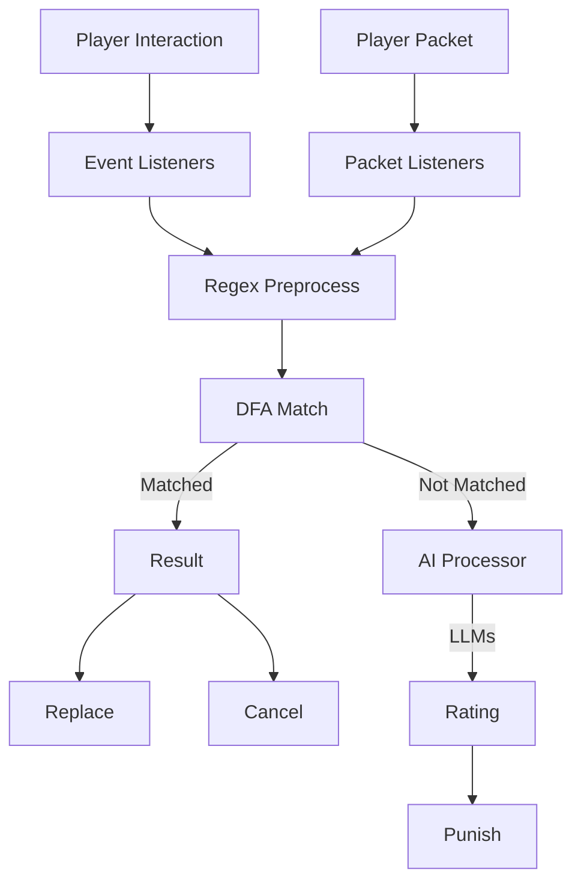

# AdvancedSensitiveWords
If you trigger the sensitive word test you'll be penalised.
One-stop-shop **ultimate** anti-swear solution for your Minecraft server!

  

Logo designed by GPT-4

## Features
1. Using DFA(Deterministic Finite Automata) algorithm
2. Plug-and-play
3. Huge and high-quality default dictionary (Over 60,000 words)
4. Blazing fast by using packets (32,000+ queries per second on a 2-core server)
5. 100% compatibility with chat plugins (Tested over 30+ plugins)
6. Full-customizable
7. Sign check support
8. Anvil check support
9. Book check support
10. Player name check support
11. **Chat context check**
12. **Sign multiple lines check**
13. **Book check with ignore lines support and cache**
14. Bedrock player compatibility
15. Compatibility with main stream login plugins (AuthMe, CatSeedLogin etc.)
16. Emoji and other unicode support
17. Chinese support
18. Fast processing depending on our custom data structure
19. Online sensitive word list support ([Repository here](https://github.com/HaHaWTH/ASW-OnlineWordList))
20. Folia supported
21. OP notifications on player swore
22. Custom punishments (Effect, command, hostile, etc.)
23. Fake message support (Inspired by [Bilibili Avalon System](https://github.com/freedom-introvert/Research-on-Avalon-System-in-Bilibili-Comment-Area))
24. PlaceHolder API expansion support
25. AI powered moderation system

**Features above make us unique in the anti-swear plugins!**

## How does this plugin work?

## Commands

`/asw help` - Show help message

`/asw reload` - Re-initialize the DFA dict and reload configurations

`/asw status` - Show the status of the AdvancedSensitiveWords

`/asw test <text>` - Test the AdvancedSensitiveWords filter with given text

`/asw info <player>` - Check total violations of specific player from database

`/asw punish <player> [type]` - Punish a player with a specific type

## Permissions

`advancedsensitivewords.bypass` - Bypass the AdvancedSensitiveWords message filter

`advancedsensitivewords.reload` - Allows you to use the /asw reload command

`advancedsensitivewords.status` - Allows you to use the /asw status command

`advancedsensitivewords.test` - Allows you to use the /asw test command

`advancedsensitivewords.help` - Allows you to use the /asw help command

`advancedsensitivewords.notice` - Retrieve the notification when players swore

`advancedsensitivewords.info` - Ability to use /asw info command

`advancedsensitivewords.update` - Receive update notifications

`advancedsensitivewords.punish` - Allows you to use the /asw punish command

**For more info, please visit [our Wiki](https://github.com/HaHaWTH/AdvancedSensitiveWords/wiki)**

## Supported Platforms
- Spigot(stable)
- Velocity(stable)
- BungeeCord(stable)
- Sponge(WIP)
- Fabric(Planned)
- Forge/NeoForge(Coming s∞n)

## Known Incompatibilities
- [HuskChat (Only proxy mode)](https://github.com/WiIIiam278/HuskChat)

## Statistics

## Open-source projects used
- **[Ollama4j(Modified to support Java 8)](https://github.com/ollama4j/ollama4j)**
- **[OpenAI4j](https://github.com/ai-for-java/openai4j)**
- **[packetevents(Used for handling chat & book packets)](https://github.com/retrooper/packetevents)**
