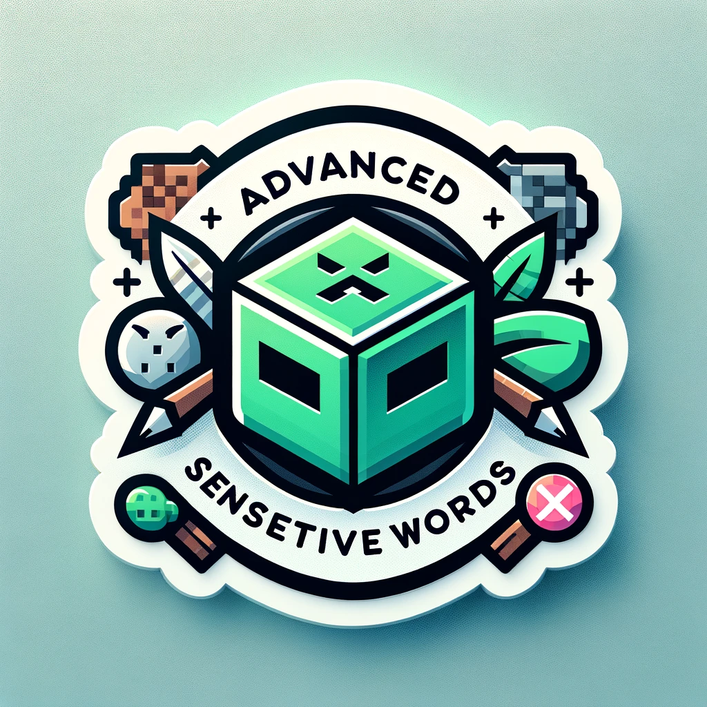

# AdvancedSensitiveWords(高级敏感词)
您Minecraft服务器的一站式终极反脏话/敏感词解决方案!

[](https://www.spigotmc.org/resources/advancedsensitivewords.115484/)

[](https://modrinth.com/plugin/advancedsensitivewords)

[English](https://github.com/hahawth/AdvancedSensitiveWords)
[简体中文](https://github.com/hahawth/AdvancedSensitiveWords/blob/main/README_zh.md)
<p align="center">
  
</p>

Logo 由 GPT-4 生成

[](https://www.codefactor.io/repository/github/hahawth/advancedsensitivewords)
[](https://www.java.com/)
[](https://github.com/hahawth/AdvancedSensitiveWords/stargazers)
[](https://jitpack.io/#HaHaWTH/AdvancedSensitiveWords)

[](https://github.com/HaHaWTH/AdvancedSensitiveWords/releases) [](https://github.com/HaHaWTH/AdvancedSensitiveWords/blob/master/LICENSE)

## 功能
1. 使用DFA(确定性有穷自动机) 算法
2. 预配置 简洁明了,开箱即用
3. 高质量的超大默认敏感词库 (60000+ 敏感词)
4. 运行在数据包层, 不会干扰其他聊天插件 (在2c2g的服务器上能做到3.2w qps)
5. 高度自定义的配置
6. 支持告示牌检测
7. 支持铁砧检测
8. 支持对书的检测
9. 支持玩家名检测
10. **聊天上下文检测✨**
11. **告示牌跨行检测**
12. **缓存书内容, 提升效率**
13. 基岩版支持
14. 兼容主流登录插件 (AuthMe, CatSeedLogin 等)
15. 支持检测Emoji等其他Unicode字符
16. 中文支持
17. 基于自定义数据结构的高速处理
18. 支持加载自定义在线词库 ([我们的在线词库](https://github.com/HaHaWTH/ASW-OnlineWordList))
19. Folia兼容
20. **假消息支持(灵感来自 [Bilibili 阿瓦隆系统](https://github.com/freedom-introvert/Research-on-Avalon-System-in-Bilibili-Comment-Area))**

**我们的目标: 干掉ChatSentry!(迫真)**

## 指令

`/asw help` - 显示帮助

`/asw reload` - 重载配置和词库

`/asw status` - 显示当前插件状态

`/asw test <文本>` - 测试插件检测效果

## 权限

`advancedsensitivewords.bypass` - 绕过检测

`advancedsensitivewords.reload` - 允许使用重载配置和词库命令 (op默认)

`advancedsensitivewords.status` - 允许使用status命令 (op默认)

`advancedsensitivewords.test` - 允许使用test命令 (op默认)

**更多详细信息，请前往[Wiki](https://github.com/HaHaWTH/AdvancedSensitiveWords/wiki)进行查看**

## 统计数据
[](https://bstats.org/plugin/bukkit/AdvancedSensitiveWords/20661)

[](https://bstats.org/plugin/bukkit/AdvancedSensitiveWords/20661)

## 开发者
AdvancedSensitiveWords 提供了一个 [简单的事件](./src/main/java/io/wdsj/asw/event/ASWFilterEvent.java) 便于开发者进行扩展.

你只需要引入下面的依赖就可以编写扩展插件辣!
```xml
<repository>
    <id>jitpack.io</id>
    <url>https://jitpack.io</url>
</repository>
```

```xml
<dependency>
    <groupId>com.github.HaHaWTH</groupId>
    <artifactId>AdvancedSensitiveWords</artifactId>
    <version>LATEST</version>
    <scope>provided</scope>
</dependency>
```

## 赞助
如果您喜欢这个项目, 请我喝杯迎宾酒罢(喜)!

[爱发电](https://afdian.net/a/114514woxiuyuan)
